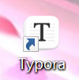

# CSS学习笔记


## 一、CSS简介

CSS用于定义网页样式和布局的样式表语言，通过CSS可以指定页面的元素的颜色、大小、字体、间距、边框、背景等样式，实现精确的页面设计。

## 二、CSS语法

CSS通常由选择器，属性，属性值组成，多个规则可以组合在一起，实现多个样式

1. 选择器声明中可以写无数条属性
2. 声明的每一条属性，都需要以英文分号结尾
3. 声明的所有属性的值都是以键值对形式出现的

<!DOCTYPE html>
<html lang="en">
<head>
    <meta charset="UTF-8">
    <meta name="viewport" content="width=device-width, initial-scale=1.0">
    <title>CSS导入方式</title>
<link rel="stylesheet" href="./css/style.css">
    <style>
        p{
            color: blue;
            font-size: 26px;
        }
        h2{
            color: green;
        }
    </style>
</head>
<body>
    <p>这是一个应用了css样式的文本</p>
    <h1 style="color: red;">这是一个一级标题标签，使用内联样式</h1>
    <h2>这是一个二级标题，应用内部样式</h2>
    <h3>这是一个三级标题，应用外部样式</h3>
</body>
</html>

注：外部样式在文件夹新建css文件，输入指令，在head标签内使用link标签，复制路径到herf,

```
<link rel="stylesheet" href="./css/style.css">
```

## 三、CSS选择器

```
<!DOCTYPE html>
<html lang="en">
<head>
    <meta charset="UTF-8">
    <meta name="viewport" content="width=device-width, initial-scale=1.0">
    <title>CSS选择器</title>
    <style>
        /*元素选择器*/
        h2{
            color: aqua;
        }
        /*类选择器*/
        .highlight{
            background-color: yellow;
        }
        /*ID选择器*/
        #header{
            font-size: 35px;
        }
        /*通用选择器*/
        *{
            font-family: '楷体';
            font-weight: bolder;
        }
        /*子元素选择器*/
        .father >.son{
            color: yellowgreen;
        }
        /*后代选择器*/
        .father p{
            color: brown;
            font-size: 36px;
        }
        /*相邻兄弟选择器*/
        h3 + p {
            background-color: red;
        }
        /*伪类选择器(悬停)*/
        #element:hover {
            background-color: blueviolet;
        }
        /*
        选中第一个子元素：first-child
        选中第N个子元素：nth-child()
        链接状态：        active
        */
        /*伪元素选择器
        ：：after
        ：：before
        */
    </style>
</head>
<body>
    <h1>不同类型的css选择器</h1>

    <h2>这是一个元素选择器示例</h2>
    <h3 class="highlight">这是一个类选择器示例</h3>
    <h3>这是另一个类选择器示例</h3>

    <h4 id="header">这是一个ID选择器示例</h4>

    <div class="father">
        <p class="son">这是一个子元素选择器示例</p>
        <div>
            <p class="grandson">这是一个后代选择器示例</p>
        </div>
    </div>

    <p>这是一个普通的 p 标签</p>
    <h3>这是一个相邻兄弟选择器示例</h3> 
    <p>这是另外一个 p 标签</p>

    <h3 id="element">这是一个伪类选择器示例</h3>
</body>
</html>
```

## 四、CSS常用属性

```
<!DOCTYPE html>
<html lang="en">
<head>
    <meta charset="UTF-8">
    <meta name="viewport" content="width=device-width, initial-scale=1.0">
    <title>CSS常用属性</title>

    <style>
     .block {
        background-color: aqua;
        width: 200px;
        height: 100px;
     }
     .inline{
        background-color: brown;
    /*无法添加height和width*/
     }
    .inline-block{
        width: 100px;
        height: 150px;
    }
    .div-inline{
        display: inline;/*块元素转为行内元素*/
        background-color: red;
    }
    .span-inline-block{
        display: inline-block;/*行内元素转为行内块元素*/
        background-color: blueviolet;
        width: 300px;
        height: 50px;

    }
    </style>

</head>
<body>
    <h1 style="font: bolder 50px 'kaiti';">这是一个font复合属性示例</h1>
    <p style="line-height: 40px;">这是一段长文本这是一段长文本这是一段长文本这是一段长文本这是一段长文本这是一段长文本这是一段长文本这是一段长文本这是一段长文本这是一段长文本这是一段长文本</p>

    <div class="block">这是一个块级元素</div>
    <span class="inline">这是一个行内元素</span>
    <span class="inline">这是一个行内元素</span>
    
     <h2>display</h2>
     <div class="div-inline">这是一个转换成行内元素的div标签</div>
     <span class="span-inline-block">这是一个转换行内块元素的标签</span>
    </body>
</html>
```

- 块元素和行内块元素都可以定义宽高，行内元素不能
- 行内块元素和行内元素一行可以有很多个行内块，但是不能有多个块级元素，块级元素会出现在下一行

```
 <div class="block">这是一个块级元素</div>
 <div class="block">这是一个块级元素</div>
 两行块级元素
```

```
  
 一行包含2张图片
```

- 可以把块元素和行内元素转换为常用的行内块元素，用到display属性

## 五、盒子模型

```
<!DOCTYPE html>
<html lang="en">
<head>
    <meta charset="UTF-8">
    <meta name="viewport" content="width=device-width, initial-scale=1.0">
    <title>盒子模型</title>
    <style>
        .border-demo{
            background-color: yellow;
            width: 300px;
            height: 200px;
            border-style: solid;
            border-width: 0 0 0 10px;
            border-color: blueviolet;
        }
        .demo{
            background-color: aqua;
            display: inline-block;
            border: 5px solid yellowgreen;
            padding: 50px;
            margin: 40px;
        }
    </style>
</head>
<body>
<div class="demo">中南民族大学</div>
<div class="border-demo">这是一个边框示例</div>
</body>
</html>
```

```
盒子模型相关属性
内容     实际内容，文本图片等
内边距    内容与边框之间的空间。padding属性
边框     盒子的边界，用border属性设置
外边距    盒子与其他元素的空间，用margin属性设置
```

1.  设置border从边框长度，样式（实线虚线），颜色等方面进行：border: 5px solid yellowgreen;
2. 设置时，边框按照上右下左的顺时针进行编辑
3. 1个值：4周；2个值；上下+左右；3个值：上+左右+下；4个值：上+下+左+右

## **六、浮动**

**网页布局方式：**

- 标准流：网页按照元素的书写顺序依次排列
- 浮动
- 定位
- 自适应布局

标准流是块级元素和行内元素按照规定的默认方式来排列，块级就是占一行，行内元素一行放好多个元素


浮动就是脱离文档流，将其移动到一边，直到左边缘或右边缘触及包含块或另一个浮动框的边缘，这样即可使得元素进行浮动  语法：

```
选择器{
      float：left/right/none
}
```

注意：浮动是相对于父元素浮动，只会在父元素的内部移动

**浮动的三大特性**：

- 脱离标准流
- 一行显示，顶部对齐
- 具备行内块元素的特性

```
<!DOCTYPE html>
<html lang="en">
<head>
    <meta charset="UTF-8">
    <meta name="viewport" content="width=device-width, initial-scale=1.0">
    <title>浮动</title>
    <style>
        .father{
            background-color: aquamarine;
            /* height: 150px; */
            border: 3px solid brown;
            overflow: hidden;/*清除浮动*/
        }
        .left-son{
            width: 100px;
            height:100px;
            background-color: yellowgreen;
            float: left;
        }
        .right-son{
            width: 100px;
            height:100px;
            background-color: yellow;
            float: right;
        }
    </style>
</head>
<body>
     <div class="father">
    <div class="left-son">左浮动</div>
    <div class="right-son">右浮动</div>
   
    </div> 
    <p>这是一段文本</p>      
</body>
</html>
```

## 七、定位

相对定位：相对于元素在文档流中正常位置进行定位的

绝对定位：相当于其最近的已定位祖先元素进行定位，不占据文档流

固定定位：相当于浏览器窗口进行定位，不占据文档流，固定在屏幕上的位置，不随滚动而滚动

```
<!DOCTYPE html>
<html lang="en">
<head>
    <meta charset="UTF-8">
    <meta name="viewport" content="width=device-width, initial-scale=1.0">
    <title>定位</title>
<style>
    .box1{
        height: 350px;
        background-color: aqua;
    }
    .box-normal{
        width: 100px;
        height: 100px;
        background-color: purple;
    }
    .box-relative{
        width: 100px;
        height: 100px;
        background-color: pink;
        position: relative;
        left: 120px;
        top: 40px;
    }
    .box2{
        height: 350px;
        background-color: yellow;
        margin-bottom: 300px;
    }
    .box-absolute{
        width: 100px;
        height: 100px;
        background-color: yellowgreen;
        position: absolute;
        /*脱离了文档流，下面的紫色元素上浮了*/
        left: 120px;
    }
    .box-fixed{
        width: 100px;
        height: 100px;
        background-color: brown;
        position: fixed;
        right: 0;
        top: 300px;
    }
</style>
</head>
<body>
<h1>相对定位</h1>
<div class="box1">
    <div class="box-normal"></div>
    <div class="box-relative"></div>
    <div class="box-normal"></div> 
</div>
<h1>绝对定位</h1>
<div class="box2">
    <div class="box-normal"></div>
    <div class="box-absolute"></div>
    <div class="box-normal"></div> 
</div>
<h1>固定定位</h1>
<div class="box-fixed"></div>
</body>
</html>
```

```
 相对定位：原来位置
 .box-relative{
        width: 100px;
        height: 100px;
        background-color: pink;
        position: relative;
        left: 120px;
        top: 40px;
    }
```

```
 绝对定位
 .box-absolute{
        width: 100px;
        height: 100px;
        background-color: yellowgreen;
        position: absolute;
        /*脱离了文档流，下面的紫色元素上浮了*/
        left: 120px;
```

